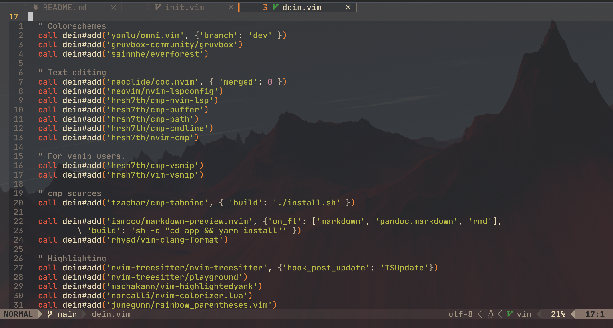

# Neovim config

Personal Neovim configuration files.

## Requirements

- Neovim >=0.5.0
- Node.js >=12.12
- "git" command in $PATH

## Plugins

  
<strong>List</strong> <small><i>(🔎 Click to expand/collapse)</i></small>

### Package Management

| Name                                                  | Description       |
| ----------------------------------------------------- | ----------------- |
| [Shougo/dein.vim](https://github.com/Shougo/dein.vim) | Plugin Management |

### User Interface

| Name                                                                            | Description                                                                        |
| ------------------------------------------------------------------------------- | ---------------------------------------------------------------------------------- |
| [wsdjeg/dein-ui.vim](https://github.com/wsdjeg/dein-ui.vim)                     | UI for Shougo's dein.vim.                                                          |
| [norcalli/nvim-colorizer.lua](https://github.com/norcalli/nvim-colorizer.lua)   | High-performance color highlighter.                                                |
| [kyazdani42/nvim-web-devicons](https://github.com/kyazdani42/nvim-web-devicons) | A lua fork of vim-devicons.                                                        |
| [liuchengxu/vim-which-key](https://github.com/liuchengxu/vim-which-key)         | Shows keybindings in popup                                                         |
| [romgrk/barbar.nvim](https://github.com/romgrk/barbar.nvim)                     | Tabline plugin with re-orderable, auto-sizing, clickable tabs.                     |
| [nvim-lualine/lualine.nvim](https://github.com/nvim-lualine/lualine.nvim)       | A blazing fast and easy to configure neovim statusline plugin written in pure lua. |
| [voldikss/vim-floaterm](https://github.com/voldikss/vim-floaterm)               | Neovim terminal in the floating/popup window.                                      |
| [kyazdani42/nvim-tree.lua](https://github.com/kyazdani42/nvim-tree.lua)         | A file explorer tree for neovim written in lua                                     |

### Syntax Highlighting

| Name                                                                                                  | Description                                                     |
| ----------------------------------------------------------------------------------------------------- | --------------------------------------------------------------- |
| [pangloss/vim-javascript](https://github.com/pangloss/vim-javascript)                                 | Vastly improved Javascript indentation and syntax support.      |
| [MaxMEllon/vim-jsx-pretty](https://github.com/MaxMEllon/vim-jsx-pretty)                               | JSX and TSX syntax pretty highlighting.                         |
| [styled-components/vim-styled-components](https://github.com/styled-components/vim-styled-components) | Bundle for styled-components based javascript files.            |
| [jackguo380/vim-lsp-cxx-highlight](https://github.com/jackguo380/vim-lsp-cxx-highlight)               | C/C++/ObjC semantic highlighting using cquery, ccls, or clangd. |
| [tomlion/vim-solidity](https://github.com/tomlion/vim-solidity)                                       | Syntax file for Solidity.                                       |

### Fuzzy Finding

| Name                                                                              | Description                                |
| --------------------------------------------------------------------------------- | ------------------------------------------ |
| [nvim-telescope/telescope.nvim](https://github.com/nvim-telescope/telescope.nvim) | Highly extendable fuzzy finder over lists. |

### Version Control

| Name                                                        | Description |
| ----------------------------------------------------------- | ----------- |
| [tpope/vim-fugitive](https://github.com/tpope/vim-fugitive) | Git Plugin  |

